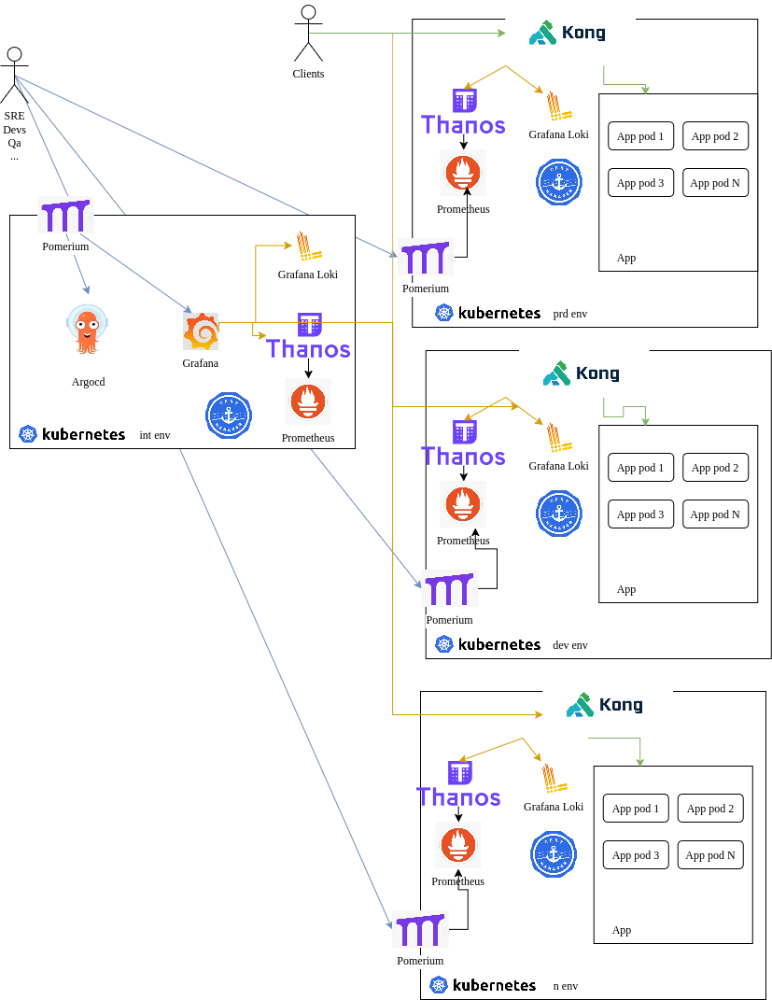

## Architecture 

Here is a birds eye view of the architecture

### Components used

* Pomerium for accessing internal tools ([more info](../security/authn+authz/))
* Prometheus + Thanos for monitoring ([more info](../monitoring/))
* Grafana Loki + fluentbit for log aggregation ([more info](../logging/))
* [Konghq](https://konghq.com/solutions/build-on-kubernetes) as api gateway
* Argocd for CD ([more info](../argocd/))
* [Cert manager](cert-manager.io) for managing certificates

## Why not just use Serverless or PaaS?

Serverless and PaaS solutions are attractive because they reduce operational effort and let you move fast. However, they introduce trade-offs that become significant as your system grows.

### 1. Cost unpredictability at scale

Serverless is often cheap at the beginning, but costs can grow rapidly and unexpectedly.

**Example:**
- You use a managed NoSQL database that charges per request, with Redis as a cache.
- A bug causes your application to bypass the cache and query the database directly.
- Database requests increase dramatically, leading to a 10–100x cost spike.
- Because billing data is aggregated and delayed, the issue may not be noticed immediately.

This makes costs harder to predict and control compared to fixed-capacity systems.

---

### 2. Limited control

With managed services, you are limited by what the provider exposes. Missing features often require workarounds or are simply not possible.

**Examples:**
- A NoSQL database limits document size (e.g., 1 MB per record).
- A managed load balancer does not support setting custom CORS headers.
- Built-in observability lacks important per endpoint metrics (e.g., latency or request counts).

These constraints can become blockers as your system evolves.

---

### 3. Vendor lock-in

Serverless architectures are often tightly coupled to provider-specific services, making migration difficult.

**Example:**
- A managed PostgreSQL service does not allow control over replication.
- As your database grows to hundreds of GBs, migrating to another provider or self-hosted setup becomes complex.
- You may need long maintenance windows or complex migration pipelines.

This reduces flexibility and makes future changes more expensive.

---

### When does Serverless make sense?

Serverless is a good fit for:
- Small projects or prototypes
- Systems with predictable, low-scale usage
- prototypes and MVPs

---

### Summary

Serverless and PaaS trade control for convenience. This is often a good trade-off early on, but for growing systems it can lead to higher costs, reduced flexibility, and difficult migrations.
