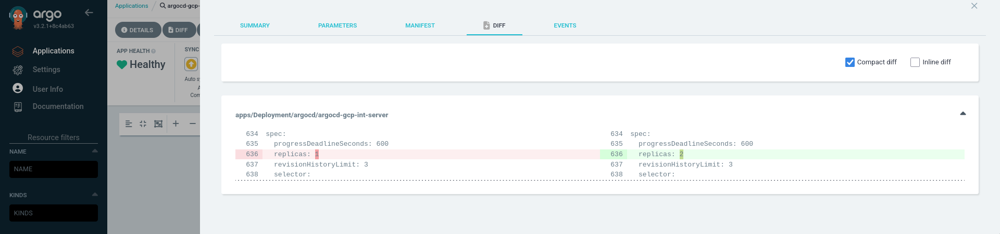
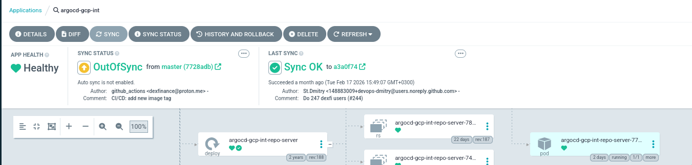
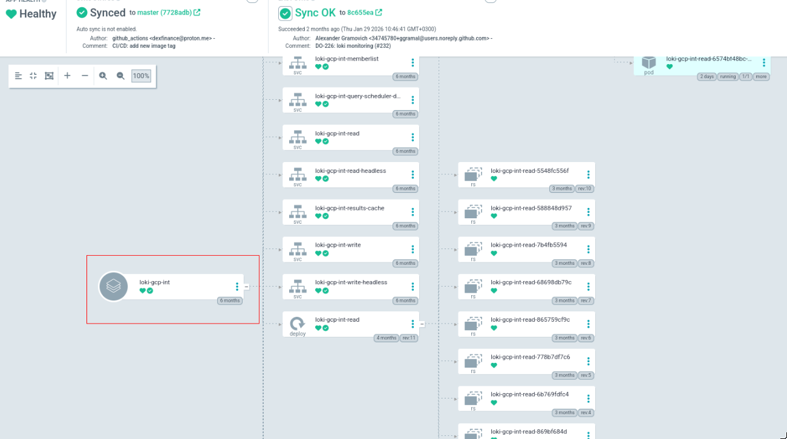
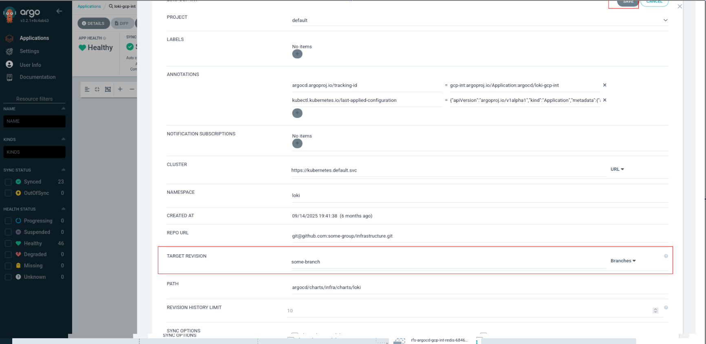
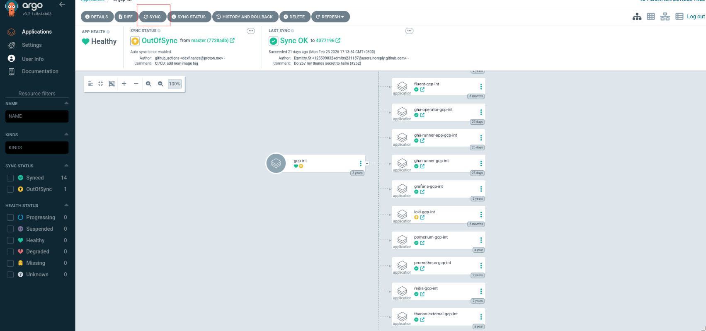

# argocd

All Kubernetes resources are managed through GitOps with [Argo CD](https://github.com/argoproj/argo-cd).

Any commit to files under the `argocd/` directory on the `master` branch changes the desired state of Kubernetes resources.

## Definitions

`app` - an Argo CD application. This can be either:
- an infrastructure component such as `loki`, `prometheus`, or `argocd`
- a product application such as `api`, `authn`, or `frontend`

## Structure

We use the [App of Apps pattern](https://argo-cd.readthedocs.io/en/latest/operator-manual/cluster-bootstrapping/?utm_source=chatgpt.com#app-of-apps-pattern-alternative) to manage Kubernetes resources.

In this pattern, one Argo CD `Application` creates other Argo CD `Application`s. The hierarchy looks like this:

```text
[ROOT APP]
   |
   +--> [ENV APP: dev]
   |        |
   |        +--> [APP: api]
   |        |        +--> Deployment
   |        |        +--> Service
   |        |        +--> Ingress
   |        |        +--> ConfigMap
   |        |
   |        +--> [APP: front-end]
   |                 +--> Deployment
   |                 +--> Service
   |                 +--> Ingress
   |
   +--> [ENV APP: prod]
            |
            +--> [APP: api]
            |        +--> Deployment
            |        +--> Service
            |        +--> Ingress
            |        +--> ConfigMap
            |
            +--> [APP: front-end]
                     +--> Deployment
                     +--> Service
                     +--> Ingress
```

The repository layout looks like this:

```text
argocd/
├── charts
│   ├── app
│   ├── ...
│   ├── infra
│   └── ...
│
├── environments
│   ├── <env 1>
│   │   ├── <app 1>
│   │   │   └── values.yaml
│   │   ├── <app 2>
│   │   │   └── values.yaml
│   │   ├── ...
│   │   ├── <app n>
│   │   │   └── values.yaml
│   │   └── env.yaml
│   │
│   ├── ...
│   │
│   ├── <env 2>
│   │   ├── <app 1>
│   │   │   └── values.yaml
│   │   ├── <app 2>
│   │   │   └── values.yaml
│   │   ├── ...
│   │   ├── <app n>
│   │   │   └── values.yaml
│   │   └── env.yaml
│   │
│   └── <env n>
│       ├── <app 1>
│       │   └── values.yaml
│       ├── <app 2>
│       │   └── values.yaml
│       ├── ...
│       ├── <app n>
│       │   └── values.yaml
│       └── env.yaml
│
└── envs.yaml
```

## Helm

- Each Argo CD `Application` (`root`, `env`, and `app`) renders resources with Helm.
- Each Argo CD `Application` has:
  - a Helm chart
  - a values file

### Root application

- Chart: `argocd/charts/infra/charts/environments`
- Values file: `argocd/envs.yaml`

### Environment application

- Chart: `argocd/charts/infra/charts/environment`
- Values file: `argocd/environments/<env_name>/env.yaml`

Example:

`argocd/environments/gcp-prd/env.yaml`

### App application

Argo CD looks up the app chart based on the app name defined in `argocd/environments/<env_name>/env.yaml`.

For infrastructure apps:
- charts are expected under `argocd/charts/infra/charts/<app_name>`
- values are expected under `argocd/environments/<env_name>/<app_name>/values.yaml`

Example:

```yaml
# argocd/environments/gcp-int/env.yaml
global:
  env:
    name: gcp-int

repository:
  revision: master

chart_apps:
  ...
  loki:
    enabled: true
    namespace: loki
```

In this case, Argo CD will look for:
- chart: `argocd/charts/infra/charts/loki`
- values: `argocd/environments/gcp-int/loki/values.yaml`

### Product apps

If an app has `app: true` parameter set in `argocd/environments/<env_name>/env.yaml`, Argo CD will look for its chart under `argocd/charts/app`.

The values file lookup stays the same.

These apps are considered product apps.

Example:

```yaml
# argocd/environments/gcp-prd/env.yaml
global:
  env:
    name: gcp-prd

repository:
  revision: master

chart_apps:
  ...
  my-awesome-app:
    enabled: true
    namespace: omega
    app: true
```

In this case, Argo CD will look for:
- chart: `argocd/charts/app/my-awesome-app`
- values: `argocd/environments/gcp-prd/my-awesome-app/values.yaml`

More information about product charts can be found [here](product/README.md).

### Chart dependencies

Each chart can have subchart dependencies defined in `Chart.yaml`.

Example:

```yaml
apiVersion: v2
name: loki
description: loki stack for all environments
type: application
version: 0.1.0

dependencies:
  # https://github.com/grafana/loki/tree/main/production/helm/loki
  - name: loki
    version: 6.51.0
    repository: https://grafana.github.io/helm-charts
    alias: loki
    condition: loki.enabled

  - name: kong-plugins
    version: 0.1.0
    repository: file://../chart_deps/konghq/plugins
    alias: kong-plugins
    condition: kong-plugins.enabled

  - name: core
    version: 0.1.0
    repository: file://../chart_deps/app/core
```

There are three types of subcharts:

- Remote [application charts](https://helm.sh/docs/topics/charts/?utm_source=chatgpt.com#chart-types), usually community or open-source charts  
  Example: [Grafana Loki chart](https://github.com/grafana/helm-charts/blob/main/charts/loki-stack/README.md)

- `Svetoch.dev` application charts  
  Example: [common chart](https://github.com/svetoch-dev/helm-charts/tree/master/charts/chart_deps/app/common)

- `Svetoch.dev` library charts  
  Example: [core chart](https://github.com/svetoch-dev/helm-charts/tree/master/charts/chart_deps/app/core)

### Shared chart repository

- `rod` templates use `https://github.com/svetoch-dev/helm-charts` for centralized Helm chart management
- `svetoch-dev/helm-charts` is included and updated via Git submodules
- everything under `argocd/charts/infra/` belongs to `svetoch-dev/helm-charts`


## Making changes

### Standard workflow

To change an application or infrastructure component:

1. Create a new branch.
2. Make changes in `argocd/environments/<your_env>/<your_app>/values.yaml`.
3. Commit your changes.
4. Open a PR/MR targeting the `master` branch.
5. After the PR/MR is reviewed and merged, open Argo CD and log in:  
   `https://ag.int.<your-company-domain>`  
   Example: `https://ag.int.acme.com`
6. Find your app and review the diff by pressing the `Diff` button.



7. Press `Sync` to apply the changes.



### Testing changes before merge

For larger or more risky changes, you can test directly from your branch before merging:

1. Create a new branch.
2. Make your changes.
3. Open your environment and app in Argo CD.
4. Click the `Application` definition.



5. Edit the `Target Revision` field and change it to your branch name.



6. Test your changes.
7. When finished, open a PR/MR targeting `master`.
8. After the PR/MR is reviewed and merged, sync the environment where you tested the app.


