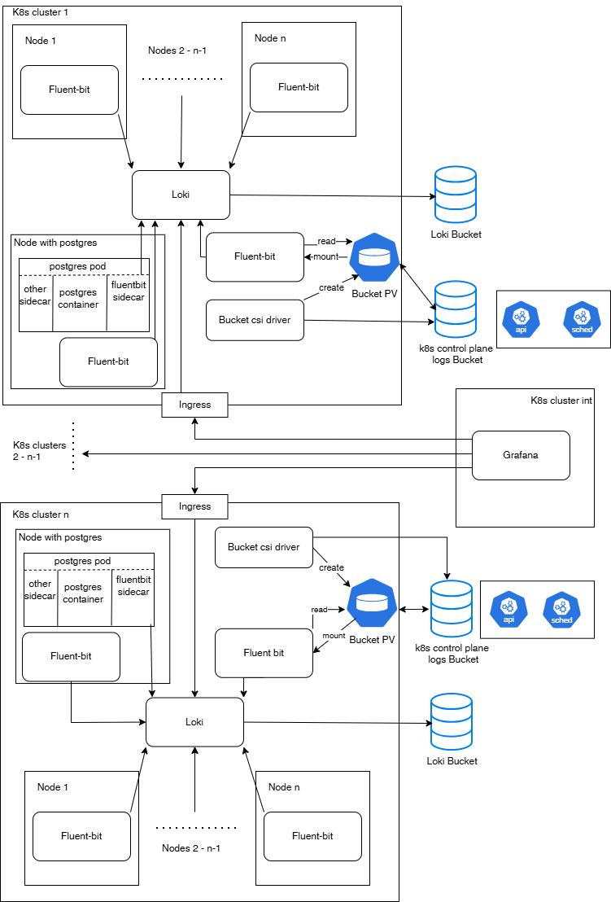

# Logging

Logging is crucial component of any infrastructure. Logging answers this basic questions
* What happened
* When, why and where did it happen
* In some cases, this provides an answer to the question of who did it
* What were the consequences
  
Having such information engineers can tell

* Logs help determine the exact location and cause of errors
* Potential problems can be identified
* Security issues

Logging consists of several components
* log collectors
* log aggregation and storage system
* visualization

# Architecture proposal

## Explanation

This architecture is based on Fluent-bit, Loki and Grafana as a common logging system for kubernetes clusters

Architecture components:
* Fluent-bit - log collector, used for:
    * Pulling and pushing logs
    * Filtering and enriching labels
    * Transforming logs to a predefined format (JSON)
* Loki used for
    * API for issueing queries (LogQL)
    * Responsible for ingesting and storing logs and processing queries
* Grafana - logs visualization (dashboards)

As any system loki has its pros and cons

Pros:
* Cost-effectiveness: Loki indexes only the metadata of logs, not the logs themselves
* Integration: Integrates seamlessly with Kubernetes, Prometheus, and Grafana
* Scalability: It can be scaled for both small and large-scale operations
* Reliability: Ensures quorum consistency for read and write operations, and has replication to protect against failures
* Ease of use: Allows you to store logs in various object storages or a file system 

Cons:
* Limited querying capabilities: Because Loki doesn't index the full log content, complex queries based on log content (e.g., searching for specific keywords within the logs) can be more challenging and may require more time to execute  
* Dependency on Grafana: While the integration with Grafana is a benefit for many users, it can also be a drawback for those who don't already use Grafana or prefer other visualization tools 
* Less advanced features: Compared to more mature systems like the ELK stack, Loki may lack some advanced features like built-in data enrichment or complex data processing pipelines

## Fluent-bit

We use a node logging agent `fluent-bit` (operated by fluentbit-operator) on each `node` (DaemonSet).
Using `Fluent-bit` we can:
* pulling pods(containers) logs (from stdout/stderr)
* pulling node logs
* getting kubernetes events
* changing structure of logs to a common view
* label filtering to use a common set of labels (loki indexes log labels to speed up the search, so there shouldn't be a lot of labels to reduce the load on loki):
  * env
  * node
  * namespace
  * job
  * app_kubernetes_io_name
  * app_kubernetes_io_version
  * app_kubernetes_io_component
  * app_kubernetes_io_instance
  * pod
  * container
  * stream
  * level

### Getting postgres logs

We use `fluent-bit` as a `sidecar` in cases where it is necessary to read log files inside the container, and there is no way to send data to stdout, but the operator does not provide such an opportunity.
This method of obtaining logs allows us not to change the settings of the postgresql cluster (in terms of logs) and use the standard settings of the postgres logs (in json format).
Fluent-bit sidecar performs several functions:
1. Reads log files
2. Filters and enriches labels
3. Sends logs to loki

### Getting logs of controll plane

Our architecture assumes the use of a managed Kubernetes service. In such environments, accessing control plane logs can be challenging since direct access to the control plane is not available. To reliably collect these logs, we use the following approach:

1. **Export logs to cloud storage**  
   Use the provider’s internal tools to transfer control plane log records into a cloud storage bucket (most clouds offer native bucket services).  

2. **Install a CSI driver**  
   Deploy the appropriate Container Storage Interface (CSI) driver to enable Kubernetes workloads to access the bucket via PersistentVolumeClaims (PVCs) and PersistentVolumes (PVs).  

3. **Mount storage in Fluent Bit pods**  
   Configure the CSI driver to mount the bucket-backed PV into a Fluent Bit pod. This is done through FUSE (the Linux userspace filesystem framework) with a userspace tool such as *s3fs* or *gcsfuse*.  

4. **Ingest logs with Fluent Bit**  
   Fluent Bit uses its `tail` input plugin to read the log files via standard OS system calls (`read()`, `open()`, `inotify()`, etc.).  

5. **Forward logs to Loki**  
   Fluent Bit processes the incoming log records and ships them to Loki for indexing and querying.  

## Loki

`Loki` is a modular system that contains many components that can either be run in logical groups (in `simple scalable deployment` mode with targets `read`, `write`, `backend`. These targets can be scaled independently, letting you customize your Loki deployment to meet your business needs for log ingestion and log query so that your infrastructure costs better match how you use Loki.). The simple scalable deployment is the default configuration installed by the Loki Helm Chart. This deployment mode is the easiest way to deploy Loki at scale. It strikes a balance between deploying in monolithic mode or deploying each component as a separate microservice.
We use `ssd` mode, in this mode `loki`:
* scale up to a few TBs of logs per day
* the easiest way to deploy Loki at scale
* read, write, and backend can be scaled independently, letting us customize our Loki deployment to meet your business needs for log ingestion and log query so that your infrastructure costs better match how you use Loki.

The Helm chart deploys the following components:
* Read component (3 replicas)
* Write component (3 replicas)
* Backend component (3 replicas)
* Index and Chunk cache (1 replica)

[Detailed description of the components](https://grafana.com/docs/loki/latest/get-started/components/)

### High Availability in Loki
is provided through the replication_factor option. Thanks to this setting, the distributor sends a request to record logs not to one replica of the ingester, but to several at once.
replication_factor:
* Distributor sends chunks to multiple Ingester
* Minimum – 3 for 3 nodes
* Allows 1 out of 3 nodes not to work
* maxFailure = (replication_factor/2)+1

A quorum is defined as floor (replication_factor/2)+1. So, for our replication_factor of 3, we require that two writes succeed. If less than two writes succeed, the distributor returns an error and the write operation will be retried. (If a write is acknowledged by 2 out of 3 ingesters, we can tolerate the loss of one ingester but not two, as this would result in data loss.)

A load balancer must sit in front of the distributor to properly balance incoming traffic to them. In Kubernetes, the service load balancer provides this service.
