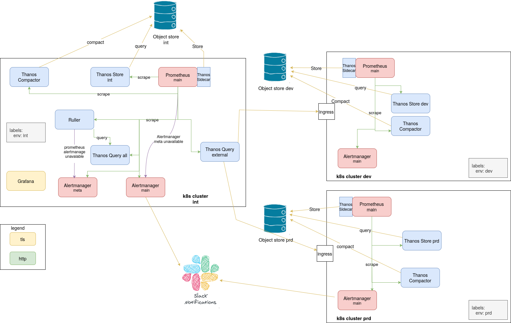

# REP-6: Meta monitoring

## Overview

The Rod monitoring architecture spans multiple environments (`int`, `dev`, `prd`) and is built around per-environment Prometheus instances, Thanos sidecars, Thanos Store/Compactor per environment, environment-local Alertmanagers, a global `Thanos Query all` in the internal environment, and Grafana for visualization (see [docs/monitoring](../../../monitoring) and the architecture diagram in [meta-monitoring.drawio](./meta-monitoring.drawio)).

Because the platform depends on this monitoring stack to detect and respond to incidents, the stack itself must be observable. This proposal defines **meta monitoring** — monitoring the monitoring components — with a clear split between **local environment responsibilities** and **global cross-environment responsibilities**.

### Current State

- Each environment runs its own Prometheus, Alertmanager, Thanos sidecar, Thanos Store and Thanos Compactor.
- A global `Thanos Query all` in the internal environment aggregates metrics from all environments.
- Grafana queries `Thanos Query all` to build cross-environment dashboards.
- There is no systematic meta monitoring:
  - Prometheus health, scrape failures and rule evaluation latency are not alerted on.
  - Thanos Sidecar, Store and Compactor availability and performance are not tracked.
  - Grafana availability and datasource errors are not monitored.
  - Alertmanager health is not verified.

### Problems

1. **Silent failures of local monitoring components**
   - If Thanos Sidecar, Store or Compactor fails in an environment, local Prometheus operators may not notice until dashboards become incomplete, queries slow down, or historical data is lost.

2. **No global visibility of Prometheus/Alertmanager health**
   - A whole Prometheus or Alertmanager instance can be down in `dev` or `prd`, but the failure is only visible from inside that environment. There is no central place to alert on cross-environment unavailability.

3. **No dedicated routing for meta-monitoring alerts**
   - Cross-environment meta alerts are mixed with regular alerts and routed through the same Alertmanagers they are supposed to monitor, increasing the risk of losing notifications during a monitoring outage.

4. **No fallback for meta Alertmanager failures**
   - If the dedicated meta Alertmanager is unavailable, cross-environment meta alerts have nowhere to go and are silently dropped.

5. **Operational uncertainty**
   - Engineers cannot distinguish between "no issues" and "no data" when a local monitoring component is unhealthy.

## Proposed Solution

Introduce meta monitoring with a strict separation of concerns:

- **Local meta monitoring**: Each environment's main Prometheus scrapes itself, its local Thanos components (Sidecar, Store, Compactor), and its local Alertmanager. It evaluates rules and alerts about local Thanos health and missing Thanos metrics.
- **Global meta monitoring**: Deploy a Thanos Ruler in the internal environment that connects to `Thanos Query all`, evaluates cross-environment rules about Prometheus, Alertmanager and Thanos Sidecar availability, and sends those alerts to a dedicated **meta Alertmanager** also running in the internal environment.

### Desired State

1. **Every Prometheus scrapes itself**
   - All Prometheus instances expose and scrape their own `/metrics` endpoint so that scrape health, rule evaluation, TSDB stats and target state are observable.

2. **Prometheus main in each environment**
   - a. Scrapes its environment's Thanos Sidecar, Thanos Store and Thanos Compactor metrics endpoints.
   - b. Evaluates alerts for Thanos Sidecar/Store/Compactor issues (for example, component down, upload failures, compaction halted, store errors, missing metrics) and pages the environment-local on-call rotation.
   - c. Scrapes its environment's Alertmanager `/metrics` endpoint.

3. **Meta Alertmanager in the internal environment**
   - A separate Alertmanager instance is deployed in the internal environment exclusively for meta-monitoring alerts.
   - It is not used for regular application/infrastructure alerts.
   - It is configured with its own notification routes and receivers (for example, a high-priority page to the platform/SRE team).

4. **Thanos Ruler component in the internal environment**
   - a. Connects to `Thanos Query all` so it can evaluate rules against metrics from every environment.
   - b. Contains alert rules for Prometheus, Alertmanager and Thanos Sidecar unavailability in **any** environment (for example, `up{job="prometheus"} == 0`, `up{job="alertmanager"} == 0` or `up{job="thanos-sidecar"} == 0` aggregated by environment).
   - c. Sends generated alerts to the **meta Alertmanager**.

5. **Prometheus main in internal environment**
   - Has Alert for meta Alertmanager unavailability 
   - Has Alert for `thanos query all` unavailability
   - Sends those alerts to Alertmanager main

### Benefits

1. **Clear ownership boundary**
   - Local monitoring teams own local Thanos/Alertmanager health; the platform/SRE team owns cross-environment meta monitoring.

2. **Faster detection of monitoring degradation**
   - Local Thanos and Alertmanager issues are caught inside the environment before they affect dashboards or incident response.

3. **Global confidence in observability**
   - Thanos Ruler provides a single place to detect when any Prometheus, Alertmanager or Thanos Sidecar anywhere in the platform is unavailable.

4. **Reliable routing for meta alerts**
   - A dedicated meta Alertmanager prevents meta alerts from being swallowed by the same outage they are reporting.

5. **No silent fallback failures**
   - The internal Prometheus fallback to the main Alertmanager guarantees that meta-monitoring notifications are delivered even if the meta Alertmanager is down.

### Trade-offs

1. **Additional component to operate**
   - Thanos Ruler and a separate meta Alertmanager add complexity and require their own high-availability setup.

2. **Dependency on `Thanos Query all`**
   - Cross-environment meta rules rely on `Thanos Query all` availability. If it is down, global meta rules cannot be evaluated.

## Design Details

### Component responsibilities

| Component | Environment | Meta-monitoring responsibility |
|-----------|-------------|--------------------------------|
| Prometheus main | Every env | Scrape self, local Thanos Sidecar/Store/Compactor, local Alertmanager; alert on local Thanos issues. |
| Thanos Sidecar | Every env | Expose metrics; scraped by local Prometheus main; uploads blocks to object store. |
| Thanos Store | Every env | Expose metrics; scraped by local Prometheus main. |
| Thanos Compactor | Every env | Expose metrics; scraped by local Prometheus main. |
| Alertmanager main | Every env | Expose metrics; scraped by local Prometheus main. |
| Thanos Query all | int | Aggregate metrics from all envs for Thanos Ruler. |
| Thanos Ruler | int | Evaluate cross-environment rules; send alerts to meta Alertmanager. |
| Alertmanager meta | int | Receive and route meta-monitoring alerts from Thanos Ruler. |
| Prometheus main | int | Send alerts to meta Alertmanager first, main Alertmanager as fallback. |

### Local scrape targets for Prometheus main

Each environment's main Prometheus should discover and scrape:

| Target | Endpoint | Purpose |
|--------|----------|---------|
| Prometheus self | `:9090/metrics` | Scrape health, rule evaluation, TSDB stats, target state. |
| Thanos Sidecar | `:10902/metrics` | Upload status, store API health, Prometheus connection state. |
| Thanos Store | `:10902/metrics` | Bucket/index health, query latency, store availability. |
| Thanos Compactor | `:10902/metrics` | Compaction/downsample progress, halted state. |
| Alertmanager main | `:9093/metrics` | Notification metrics, config reload status. |

### Local alerts evaluated by Prometheus main

- `ThanosSidecarDown` — `up{job="thanos-sidecar"} == 0 or absent(up{job="thanos-sidecar"})`.
- `ThanosSidecarUploadFailures` — `rate(thanos_sidecar_upload_operations_total{status="error"}[5m]) > 0`.
- `ThanosStoreDown` — `up{job="thanos-store"} == 0 or absent(up{job="thanos-store"})`.
- `ThanosCompactorDown` — `up{job="thanos-compactor"} == 0 or absent(up{job="thanos-compactor"})`.
- `ThanosCompactorHalted` — `thanos_compact_halted == 1`.
- `ThanosStoreHighErrorRate` — high rate of `thanos_store_bucket_operations_total{status="error"}` or equivalent.

These alerts are routed to the environment's main Alertmanager and handled by the local on-call rotation.

### Thanos Ruler global rules

Thanos Ruler connects to `Thanos Query all` and evaluates rules against metrics from all environments. Example cross-environment alerts:

- `PrometheusUnavailable` — `up{job="prometheus"} == 0 or absent(up{job="prometheus"})` grouped by `env` and `instance`.
- `AlertmanagerUnavailable` — `up{job="alertmanager"} == 0 or absent(up{job="alertmanager"})` grouped by `env` and `instance`.
- `ThanosSidecarUnavailable` — `up{job="thanos-sidecar"} == 0 or absent(up{job="thanos-sidecar"})` grouped by `env` and `instance`.
- `PrometheusTargetScrapeFailures` — high rate of `prometheus_target_scrapes_exceeded_sample_limit_total` or scrape failures aggregated by `env`.
- `PrometheusRuleEvaluationFailures` — `rate(prometheus_rule_evaluation_failures_total[5m]) > 0` aggregated by `env`.

These alerts are sent to the **meta Alertmanager**.

### Alertmanager meta

- Deployed in the internal environment.
- Separate from the main Alertmanager in that environment.
- Notification receivers target the platform/SRE team.
- Its own metrics are scraped by the local Prometheus main so the meta Alertmanager itself is monitored locally.

### Dashboards

A `System` dashboard in Grafana (queried through `Thanos Query all`) should include:

- Prometheus availability per environment.
- Alertmanager availability per environment.
- Thanos Sidecar/Store/Compactor availability and error rates per environment.
- Thanos Ruler rule evaluation health.
- Meta Alertmanager notification success/failure rates.
