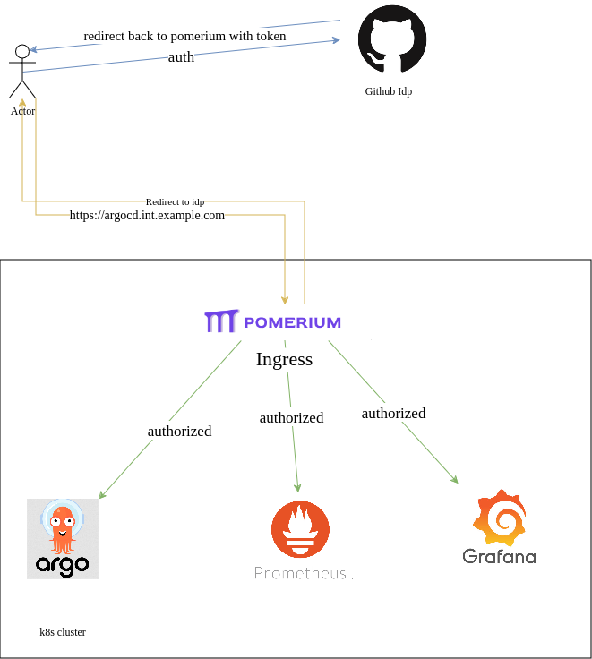
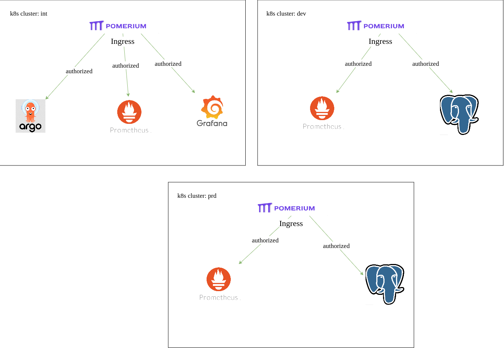

# 🔐 Authentication and Authorization

## 🎯 Motivation

As **Site Reliability Engineers (SREs)**, our goals for authentication and authorization are:

- ✅ A single authentication and authorization layer for all infrastructure services.
- ⚙️ Simple to configure, update, and maintain.
- ➕ Effortless onboarding of new infrastructure components.
- 🔐 Centralized authentication via an SSO (Single Sign-On) provider.

## 🧱 Architecture

To provide a unified access control layer for infrastructure services (e.g., Grafana, ArgoCD, Prometheus), we use an **identity-aware proxy**, [**Pomerium**](https://www.pomerium.com/docs).

Pomerium acts as a secure gateway between users and internal services. It authenticates users via a configured Identity Provider (IdP), then enforces access policies to determine if requests should be routed to the protected service.



### 🔄 Flow

1. The user attempts to access a service, e.g., `https://argocd.int.example.com`.
2. **Pomerium Ingress** checks for an active session (stored in memory or PostgreSQL).
3. If no session is found, the user is redirected to authenticate via the configured IdP (e.g., GitHub).
4. Upon successful authentication, Pomerium receives user claims (e.g., email, groups).
5. Pomerium evaluates access based on:
   - Received claims
   - The authorization policy defined in the ingress annotations  
   It then decides whether to forward the request to the service.

## 🔐 Authorization Annotations

Access to an ingress endpoint is controlled via the `ingress.pomerium.io/policy` annotation.

### 🎯 Example: Specific Users

```yaml
ingress.pomerium.io/policy: |
  allow:
    or:
      - user:
          is: user1@example.com
      - user:
          is: user2@example.com
```

This configuration allows only `user1@example.com` and `user2@example.com` to access the resource.

### 🌐 Example: Domain-Based Access

```yaml
ingress.pomerium.io/policy: |
  allow:
    and:
      - domain:
          is: example.com
```

This policy grants access to **any user** with an email address from the `example.com` domain.

## ☁️ Multi-Cluster Support

In environments with **multiple Kubernetes clusters**, each cluster runs its **own Pomerium ingress controller**, maintaining consistent auth behavior across clusters.



